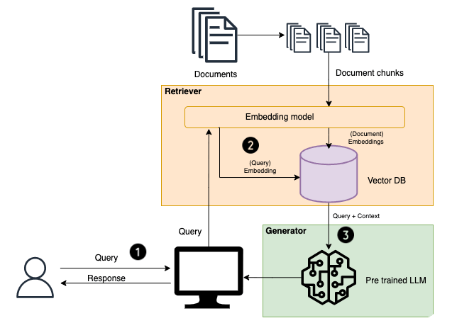

# RAG

Rag
La génération augmentée de récupération ou RAG (Retrieval-Augmented Generation) est une technique qui améliore la qualité et la pertinence des réponses fournies par une application d'IA générative

le but:
La RAG permet au LLM de présenter des informations précises avec l'attribution de la source. Le résultat peut inclure des citations ou des références à des sources. Les utilisateurs peuvent également rechercher eux-mêmes les documents sources s'ils ont besoin de précisions ou de détails supplémentaires.

[*video*](https://www.youtube.com/watch?v=S-LUZ4vrkIQ)

Flux de données d'un système RAG:

